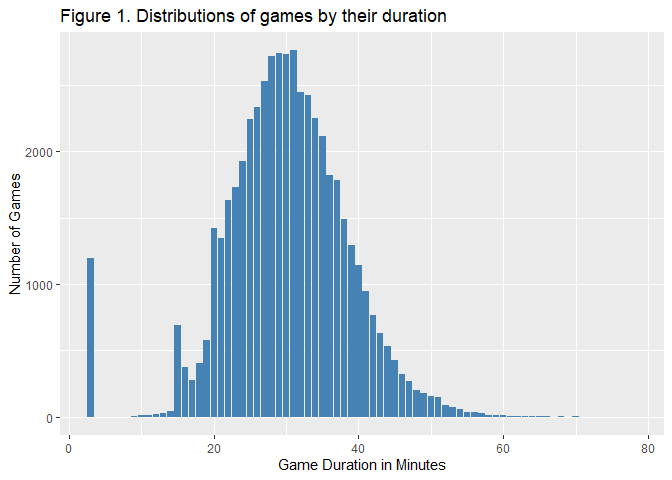
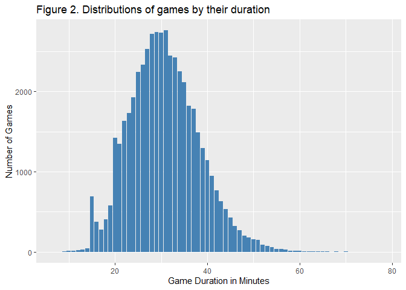
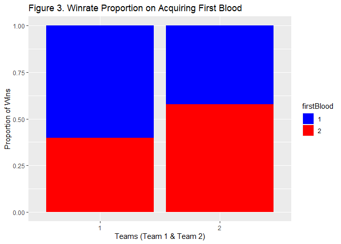
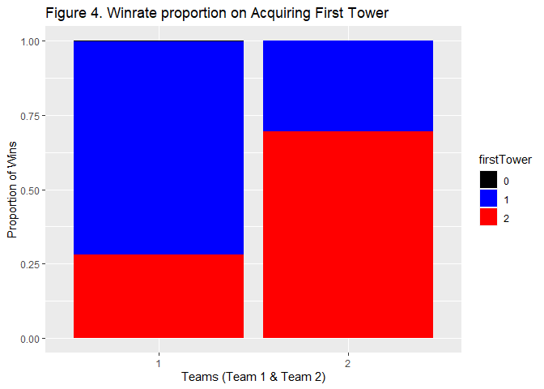
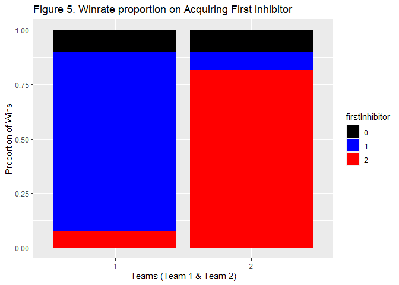
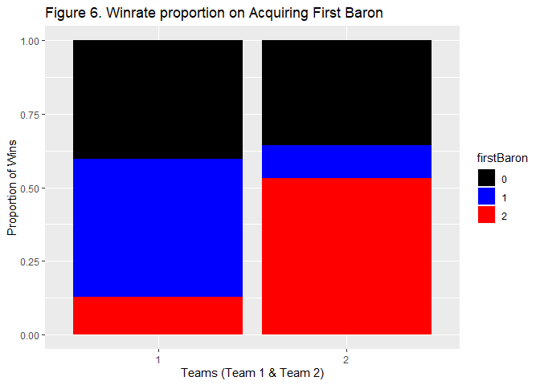
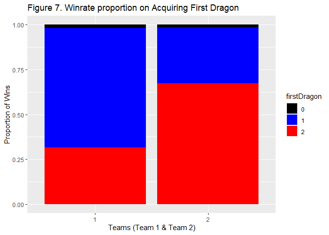
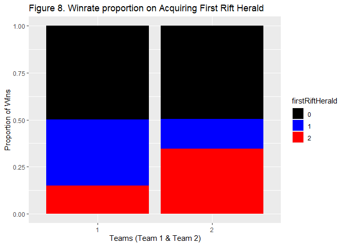

Game Strategy and Prioritization in League of Legends
================
Paul Radosevic
20/05/2021

## An Exploration into League of Legends via Data Analysis

League of Legends is a video game of the MOBA genre
(Multi-Online-Battle-Arena) which was released in 2009 by Riot Games and
has persisted as one of the most played games to this day. Briefly
summarised, this game features a player vs player, 5v5 team format. Each
team consists of 5 players that can pick a character (champion) at their
choosing, each with their own skills and abilities and they will compete
on a battlefield against the other team of 5. The battlefield is
symmetrical with two core bases (nexus), and a number of structures
defending their base. The team to break through the defences and destroy
the enemy nexus first wins. Throughout this game though, there are a
number of objectives that can be claimed by each team, however this
requires a lot of strategy and communication across team members. Games
typically last between 20-40 minutes and due to the multitude of actions
you as a player can perform in a single match, the possibilities and
strategies are endless when it comes to how you and your team compose
your victory. A pressing question especially in the context of esports
will come down to, ‘what makes a successful team?’ (Nascimento Junior et
al., 2017). Therefore, upon acquiring a dataset of played League of
Legends games from Kaggle which display various statistics like
objectives taken, I aim to identify what elements or objectives result
in the largest probability to win any given game.

(Summoner’s Rift: a bird’s eye view of the map in game (credit: Riot
Games))

## Summary Statistics

First let us take a look at some of the statistics of our data set
(51490 total observations):

    ##   gameDuration   winner    firstBlood firstTower firstInhibitor firstBaron
    ##  Min.   : 3.00   1:26077   0:  555    0: 1213    0: 6276        0:20258   
    ##  1st Qu.:25.00   2:25413   1:26113    1:25861    1:23054        1:14758   
    ##  Median :30.00             2:24822    2:24416    2:22160        2:16474   
    ##  Mean   :30.06                                                            
    ##  3rd Qu.:35.00                                                            
    ##  Max.   :78.00                                                            
    ##  firstDragon firstRiftHerald
    ##  0: 2000     0:26179        
    ##  1:24690     1:12948        
    ##  2:24800     2:12363        
    ##                             
    ##                             
    ## 

## Game Duration

Let us follow this by taking a look at how long the games in this data
set tend to take:

<!-- -->

The game duration of games here follows a relatively normal
distribution, where the mean duration is 30 minutes and really long
games taper off at around 40 minutes and later. Two noteworthy points
here are the two spikes at 3 minutes and 15 minutes. These two points
can be explained by the surrender system in place in the game. In the
middle of your game, if one team feels like winning that particular game
is impossible, they can issue a surrender vote where if enough people
vote yes, a surrender is initiated and the game will automatically end
with the surrendering team losing and the other team winning. Surrenders
can be issued after 15 minutes where there is a unanimous vote from all
players on the team, and after 20 minutes where 4 of the 5 players vote
yes to surrender. A new system introduced recently to the game called
“remake” allowed players to cast surrender votes in a small window
between minutes 3 and 4 only when the game recognizes that a player has
disconnected or left the game in the first 3 minutes of the game.
Issuing this will not penalize the rest of the team who surrendered as
it does not count as a loss or a win. From the visual above we see
players making use of this function.

To continue with comparing objectives in their respective games, it
would be wise to proceed to leave out all games that were ended via the
remake function (i.e. games of duration less than 5 minutes) as this
will not be representative of actual played games. This leaves us with
the following distribution:

<!-- -->

## Evaluating Objectives

Finally, in the data set there are various variables labeling particular
objectives, we can attempt to find the proportion of games won per team
based on a single objective. 0 = No team took that objective that game,
1 = team 1, 2 = team 2.

The following visual outlines proportions of games based on obtaining
first blood (first player kill made by a team):
<!-- -->

The following visual outlines proportions of games based on obtaining
first tower (first enemy tower destroyed by a team):

<!-- -->

The following visual outlines proportions of games based on obtaining
first inhibitor (first enemy inhibitor destroyed by a team):

<!-- -->

The following visual outlines proportions of games based on obtaining
first baron (first baron kill made by a team, \*Baron is a non-playable
character that a team can slay to obtain rewards for their team):

<!-- -->

The following visual outlines proportions of games based on obtaining
first dragon (first dragon kill made by a team \*The Dragon is a
non-playable character that a team can slay to obtain rewards for their
team):

<!-- -->

The following visual outlines proportions of games based on obtaining
first Rift Herald (first Rift Herald kill made by a team \*The Rift
Herald is a non-playable character that a team can slay to obtain
rewards for their team):

<!-- -->

Some proportions were spread primarily across the two teams, like which
team took first blood, or who took down the first tower. Other
proportions like the first team taking the Rift Herald had a big divide
in the sense that about half of all the games played in this data set
did not take the objective; although optional in a game, taking this
objective does seem to have an impact on the proportions of games won
when a team obtained it. The same also goes for Baron, arguably the
hardest objective to take down as a single player, and doing so heavily
sways the game to the favor of the team who slayed it. Ferrari (2013)
reports similar experiences with this scenario and describes this as a
sort of “snowball” effect. Not only does taking an objective reward the
team for taking that objective, it also punishes the opposing team as
they cannot obtain that objective anymore. Additionally, objectives like
Baron and Rift Herald in and of themselves force team cooperation. As
these objectives are hard to take out by one single player, the better
cooperating/functioning team will surpass the opposing team let alone
the mind of a singular player (Kim et al., 2017, Kou & Gui, 2014).

## Focusing on One Objective

To conclude this analysis, there are some final statistics that can be
investigated to answer additional sub questions. A prominent sub
question for these objectives being, ‘is acquiring just the first one
critical to winning a game, or is it important to acquire as many of
that objective as possible?’ Objectives like Dragon, or enemy structures
like Towers and Inhibitors can be taken down multiple times. Therefore,
we finalize this exploration by seeing how the number of times a single
objective was taken affects a team’s potential of winning.

The following visual outlines the number of games won depending on how
many enemy Towers were destroyed (Maximum can be 11):

<!-- -->

What can be seen here is that the proportion of games won heavily favor
a team taking down the most amount of enemy Towers. Technically
speaking, a team cannot destroy the enemy’s Nexus if they do not take
down at least 5 Towers, so most games under the 5 Tower mark are most
likely caused due to the enemy team issuing a surrender. However,
concluding this part, taking as many towers is highly favorable for a
team’s chance at succeeding.

Next we shall take a look at the other main structure of a team’s base,
the Inhibitor. Each team’s base has 3 Inhibitors, and taking them down
results in large rewards for the respective team. Once destroyed, these
structures will automatically rebuild themselves after 5 minutes.
Therefore, destroying more than 3 Inhibitors is not impossible.

The following visual outlines the number of games won depending on how
many enemy Inhibitors were destroyed:

<!-- -->

Interestingly, although destroying the first Inhibitor was a key factor
into winning a game as seen in Figure 5, taking down more than 1
Inhibitor does not really mean a player will win more games. Having
destroyed more than 2 Inhibitors will be redundant as the game will be
going on for a lot longer than it could be. This is what players might
refer to as ‘overkill’.

Lastly, we shall take a look at the Dragon, a non-playable character
that acts as an objective on the map that ‘respawns’ every 5 minutes
upon being slain. The following visual outlines the number of games won
depending on how many Dragons were taken by one team:

<!-- -->

What is fascinating about this distribution is that it seems taking
multiple Dragons, more than 2 for instance, does not represent more
games being won with that outcome. The reward that the Dragon provides a
team increases in impact for every Dragon that team has taken
previously. Although taking 4, 5, or even 6 Dragons will mean that any
given game will go on for quite some time. A possible outcome from this
is that players might prioritize winning quickly over maximum impact
(Mora-Cantallops & Sicilia, 2019).

## Conclusion

What can we conclude from this investigation to answer the question
‘what does a team need to prioritize to maximize their odds of winning?
Using this dataset it is revealed that players should prioritize taking
down the first Tower and especially first Inhibitor. Additionally, a
team should prioritize taking down as many enemy Towers as possible,
however ’respawning’ objectives like Dragons or Inhibitors should be
avoided after a team has claimed at least 1 or 2. This is reflective of
core mentality across many competitive players attempted to climb the
ranked leaderboards, a team should focus on winning with effective and
efficient tactics, there is no priority to make games last longer than
they should. Further research into this topic may include investigating
what a particular team might need to prioritize when they are on the
unfavorable side of a game. Or additionally, looking closely at
individual champions and seeing how each champion favors against
particular objectives.

## References

Ferrari, S. (2013, August). From Generative to Conventional Play: MOBA
and League of Legends. In DiGRA Conference (pp. 1-17).

Kim, Y. J., Engel, D., Woolley, A. W., Lin, J. Y. T., McArthur, N., &
Malone, T. W. (2017, February). What makes a strong team? Using
collective intelligence to predict team performance in League of
Legends. In Proceedings of the 2017 ACM conference on computer supported
cooperative work and social computing (pp. 2316-2329).

Kou, Y., & Gui, X. (2014, October). Playing with strangers:
understanding temporary teams in League of Legends. In Proceedings of
the first ACM SIGCHI annual symposium on Computer-human interaction in
play (pp. 161-169).

Mora-Cantallops, M., & Sicilia, M. Á. (2019). Team efficiency and
network structure: The case of professional League of Legends. Social
Networks, 58, 105-115.

Nascimento Junior, F. F. D., Melo, A. S. D. C., da Costa, I. B., &
Marinho, L. B. (2017, October). Profiling successful team behaviors in
League of Legends. In Proceedings of the 23rd Brazillian Symposium on
Multimedia and the Web (pp. 261-268).
